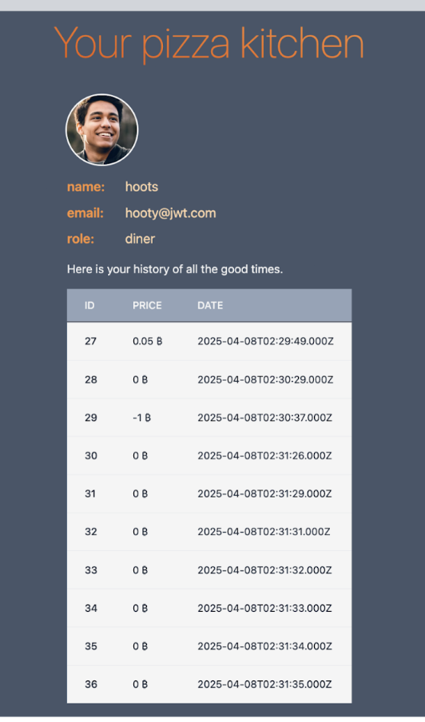
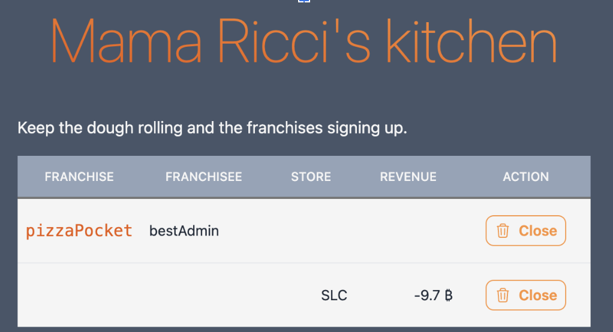
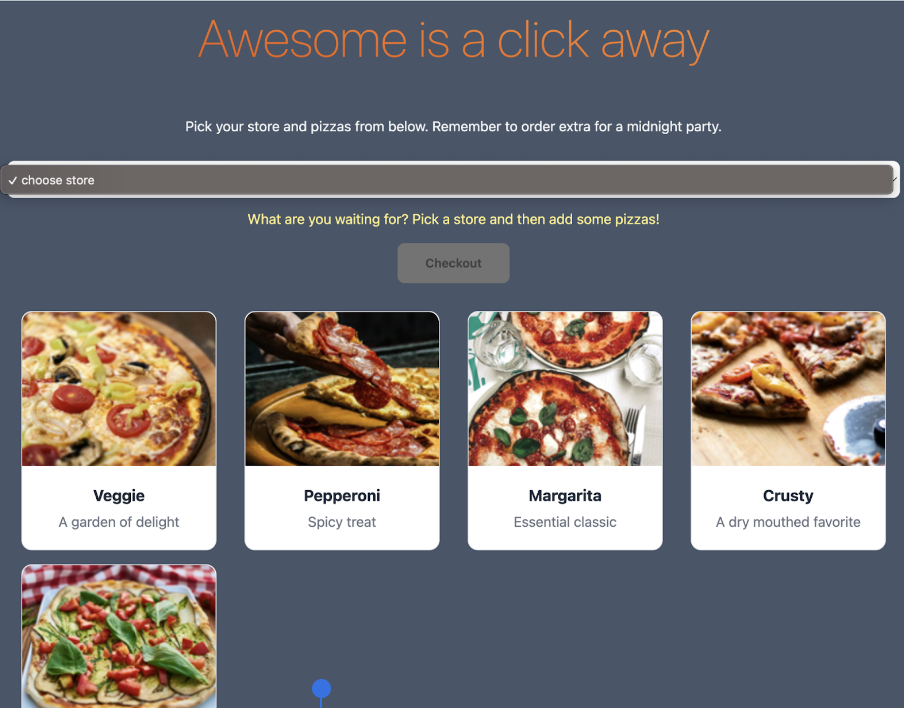
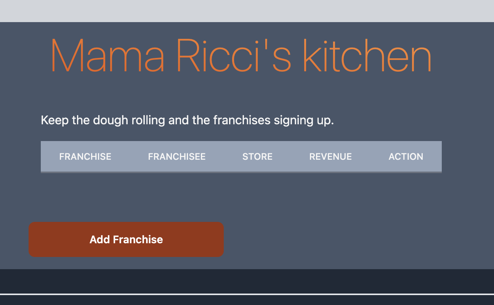
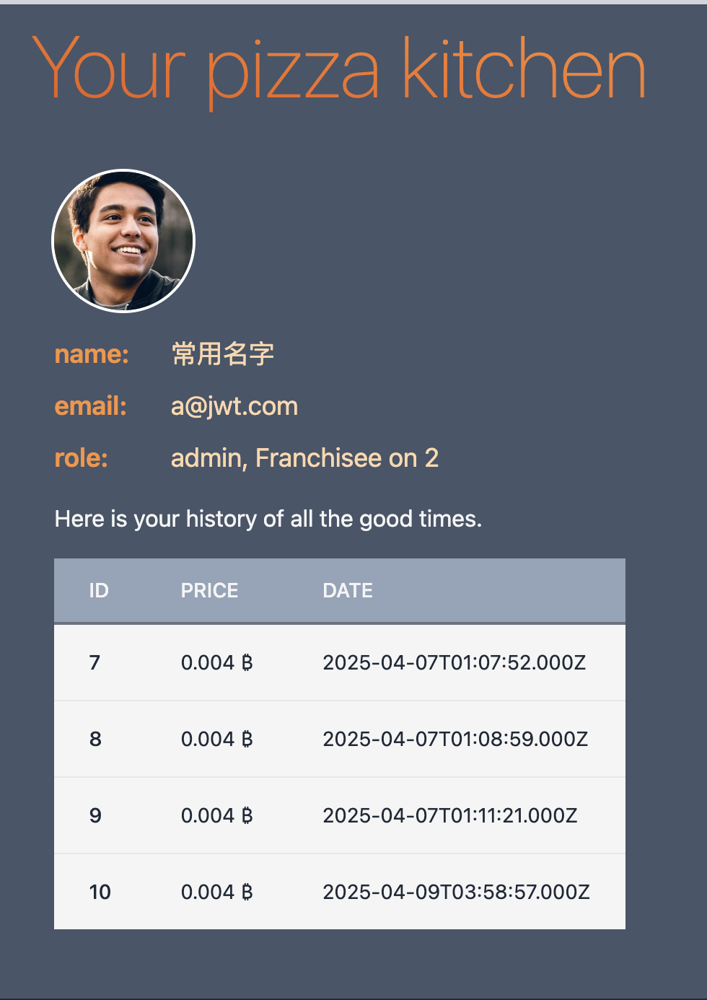
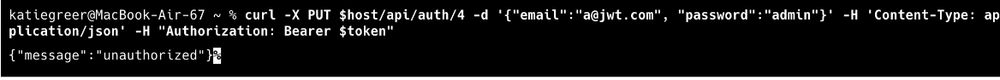

| Self-Attack #1: | Katherine Greer                                                                                                |
|-----------------|----------------------------------------------------------------------------------------------------------------|
| Date            | 4/7/2025                                                                                                       |
| Target          | pizza.tastetrove.click                                                                                         |
| Classification  | Insecure Design                                                                                                |
| Severity        | Medium                                                                                                         |
| Description     | Hacker was able to purchase pizzas for free or even negative amounts, causing the store to lose lots of money. |
| Images          |                                                                            |
| Corrections     | Validate more than just the menu id. Verify that important information like price has not been modified.       |

| Self-Attack #2:  | Katherine Greer                                                                                                                                                                                                                                   |
|------------------|---------------------------------------------------------------------------------------------------------------------------------------------------------------------------------------------------------------------------------------------------|
| Date             | 4/7/2025                                                                                                                                                                                                                                          |
| Target           | pizza.tastetrove.click                                                                                                                                                                                                                            |
| Classification   | Injection                                                                                                                                                                                                                                         |
| Severity         | High                                                                                                                                                                                                                                              |
| Description      | All existing accounts but the first (the admin account) are inaccessible due to them all having the same username and password. Hacker has changed the email and password of this account. Hacker has deleted all stores using these permissions. |
| Images           |                                                                                                                                                                             |
| Corrections      | Sanitize all user inputs with the database, including when the user alters their username/password.                                                                                                                                               |

| Peer-Attack #1:  | Hacker: Katherine Greer Victim: KanJim Kim                                                                                                         |
|------------------|----------------------------------------------------------------------------------------------------------------------------------------------------|
| Date             | 4/9/2025                                                                                                                                          |
| Target           | pizza.byulage.click                                                                                                                                |
| Classification   | Security Misconfiguration                                                                                                                          |
| Severity         | High                                                                                                                                               |
| Description      | The admin account credentials were available on a public repository, allowing the hacker to get admin permissions and delete all franchise stores. |
| Images           |                                                                                  |
| Corrections      | Use secrets to avoid having admin credentials visible.                                                                                             |

| Peer-Attack #2:  | Hacker: Katherine Greer Victim: KanJim Kim                                                                                                                   |
|------------------|--------------------------------------------------------------------------------------------------------------------------------------------------------------|
| Date             | 4/9/2025                                                                                                                                                    |
| Target           | pizza.byulage.click                                                                                                                                          |
| Classification   | Injection                                                                                                                                                    |
| Severity         | High (except not because it didn’t work)                                                                                                                     |
| Description      | Hacker attempted to use SQL injection on the update user endpoint but was not successful because the update user endpoint is broken and doesn’t work anyway. |
| Images           |                                                                                                                                                             |
| Corrections      | Fix database so that users can update their username and password. Then make sure that all user inputs are sanitized.                                        |

## 1. Self Attack KangJin Kim

#### Finding 1

| Item | Details |
|------|---------|
| Date | 4/8/2025 |
| Target | https://pizza.byulage.click/ |
| Classification | Injection |
| Severity | High |
| Description | SQL injection possible in the curl updateUser command |
| Images | const query = `UPDATE user SET ${params.join(', ')} WHERE id=${userId}`; This directly interpolates values into the SQL string, thus direct array interpolation could be exploited.  |
| Corrections | Added sanitization to Database.js to avoid injection attacks |

## 2. Self Attack KangJin Kim
#### Finding 2

| Item | Details |
|------|---------|
| Date | 4/9/2025 |
| Target | https://pizza.byulage.click/ |
| Classification | Injection |
| Severity | Low |
| Description | SQL injection possible registering duplicate id |
| Images |   |
| Corrections | Added code to Database.js to avoid users with duplicate id|

### Attack Against Katie Greer

##### Attack 1. 
| Item | Details |
|------|---------|
| Date | 4/9/2025 |
| Target | https://pizza.tastetrove.click |
| Classification | Injection |
| Severity | LOW |
| Description |  Attempted admin access testing using SQL injection via input fields |
| Images |  |
| Correction | No correction needed because the attack failed |

##### Attack 2. 

| Item | Details |
|------|---------|
| Date | 4/9/2025 |
| Target | https://pizza.tastetrove.click |
| Classification | Injection |
| Severity | LOW |
| Description |  Attempted injection to change order info via curl code |
| Images |  |
| Correction | Need to fix code in database.js since it is possible to order pizza through Non-existing franchise such as "BYU", but wasn't able to change the description or price of pizza|

**Combined Summary of Findings**
Considering all attacks performed in this assignment, we have found that it is important that all user inputs that could get executed in an SQL query need to be sanitized in order to prevent hackers from changing the database. Additionally, whenever any user input is passed in, for example when they order a pizza, all components of the input should be validated using the database, to prevent users from performing invalid actions. Some invalid actions are relatively harmless, like ordering from a non-existent store since this is only possible via curl commands so no regular user would do so accidentally. Other invalid actions, however, like being able to change the price of a pizza, are harmful, so it is important to check all user input, since it is unknown if seemingly harmless attacks could potentially be harmful in the wrong hands. Finally, when code is posted publicly, it is important that no important credentials, especially admin credentials, are left visible where anyone could find and use them.
